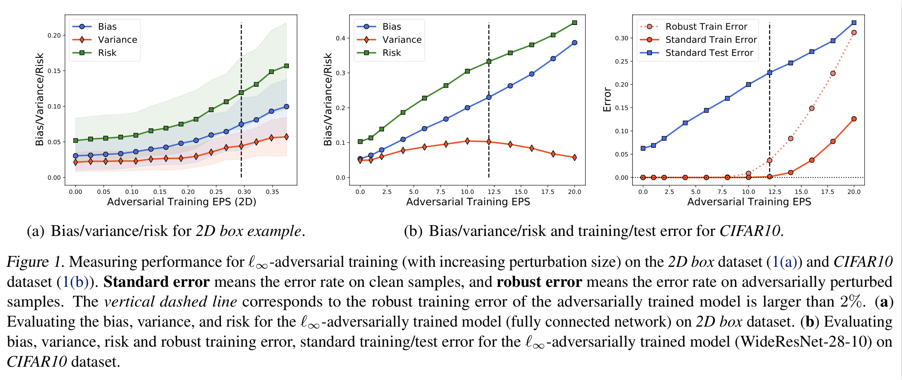
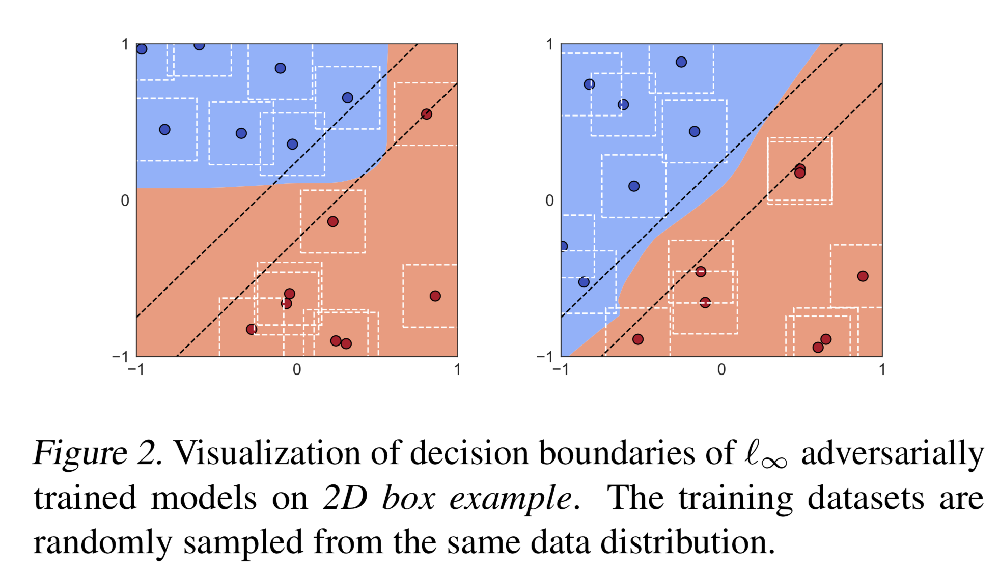

# BiasVariance-AdversarialTraining

This is the code for the paper "Understanding Generalization in Adversarial Training via the Bias-Variance Decomposition".


<p align="center">
    
</p>
<p align="center">
</p>


<p align="center">
    
</p>
<p align="center">
</p>


## Prerequisites
* Python
* Pytorch (1.3.1)
* CUDA
* numpy

There are 4 folders, ```cifar10```, ```cifar100```, ```2d```, and ```logistic_regression```. 
First ```cd``` into the directory. 

## CIFAR10 
### CIFAR10 Training
To run the L-infinity adversarial training with ```eps=8.0``` on the CIFAR10 dataset saved to folder ```model_Linf_eps8```, run
```text
python train_adv.py --norm l_inf --fname model_Linf_eps8 --epsilon 8 --width-factor 10
```
#### Arguments:
* ```norm```: ```l_p``` norm for adversarial attack.
* ```width-factor```: width-factor of the WideResNet-28.
* ```epochs```: how many epochs for training.
* ```fname```: specify the name of the folder for saving logs and checkpoints.


### CIFAR10 Evaluation
To evaluate the standard (squared loss) bias-variance on the above model ```model_Linf_eps8``` on epoch ```200```, run
```text
python eval_adv_bv_mse.py  --fname model_Linf_eps8 --resume 200 --attack none
```
To evaluate the adversarial (squared loss) bias-variance on the above model ```model_Linf_eps8``` on epoch ```200``` 
with perturbation size ```eps=6```, run
```text
python eval_adv_bv_mse.py  --fname model_Linf_eps8 --resume 200 --attack pgd --epsilon 6 
```
To evaluate the standard (cross-entropy) bias-variance on the above model ```model_Linf_eps8``` on epoch ```200```, run
```text
python eval_adv_bv_kl.py  --fname model_Linf_eps8 --resume 200 --attack none
```
#### Arguments:
* ```fname```: specify the name of the folder for evaluation.
* ```resume```: specify the epoch of the train models for evaluation.
* ```attack```: attack method for evaluation.
* ```epsilon```: perturbation radius of the adversarial attack.

##### Log file:
The results (including bias and variance) will be save in ```'bv_mse_log_epoch{}_eps{}.txt'.format(resume, epsilon) ```(for mse)/```bv_kl_log_epoch{}_eps{}.txt'.format(resume, epsilon)```(for cross-entropy), in the folder ```fname```.

The log file includes the following,

| trial | train loss  | test acc | bias | variance |
| --------------------- | ------------- | ------------| ------------ |--------------- |


## CIFAR100 
### CIFAR100 Training
To run the L-infinity adversarial training with ```eps=8.0``` on the CIFAR100 dataset saved to folder ```model_Linf_eps8```, run
```text
python train_adv.py --norm l_inf --fname model_Linf_eps8 --epsilon 8
```
### CIFAR100 Evaluation
To evaluate the standard (squared loss) bias-variance on the above model ```model_Linf_eps8``` on epoch ```200```, run
```text
python eval_adv_bv_mse.py  --fname model_Linf_eps8 --resume 200 --attack none
```

### 2D box example
To reproduce the 2D box example results, run ```2d_bv.ipynb```.

### Linear Logistic Regression
To reproduce the logistic_regression results, run ```logistic_regression.ipynb```.


## Reference
For more experimental and technical details, please check our [paper](https://arxiv.org/abs/todo).
```
@article{yu2021understanding,
  title={Understanding Generalization in Adversarial Training via the Bias-Variance Decomposition},
  author={Yaodong Yu and Zitong Yang and Edgar Dobriban and Jacob Steinhardt and Yi Ma},
  journal={arXiv preprint arXiv:2103.09947},
  year={2021}
}
```
